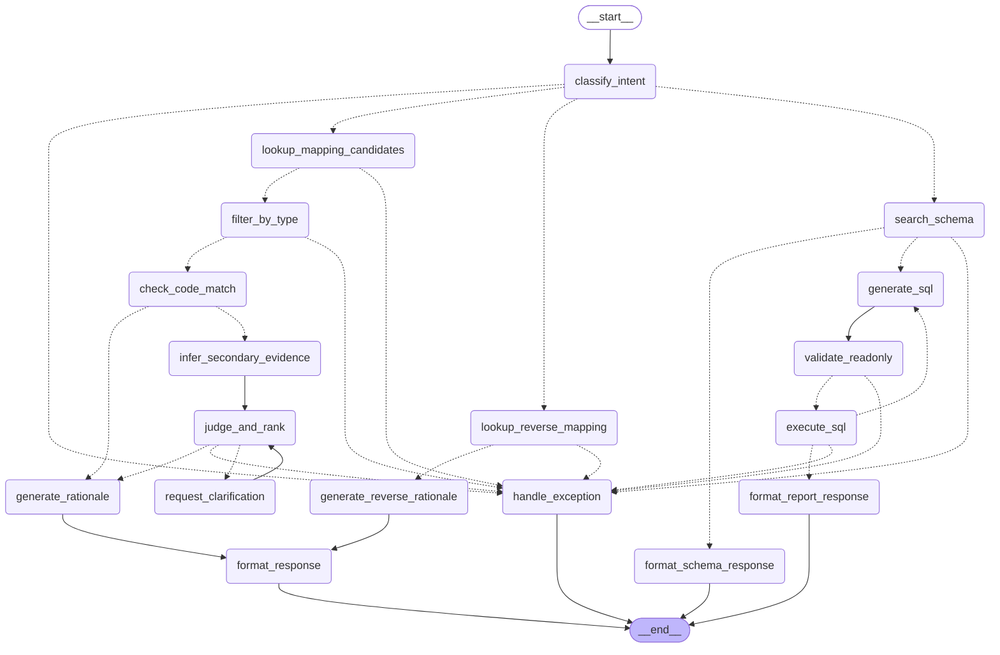

# 🦖 SchemaBridge


**AS-IS ↔ TO-BE 매핑 판단을 돕는 LLM Agent.**
증권사 차세대(핵심시스템 마이그레이션) 프로젝트에서, 매핑정의서를 대조해가며 TO-BE 쿼리를 개발하는 작업을 자동화합니다.

---

## 왜 만들었나

차세대 프로젝트에서는 AS-IS 코드를 분석해 TO-BE ERD를 설계하고, 이후 테이블·컬럼 매핑정의서를 엑셀로 수작업 작성합니다. 개발자는 TO-BE 쿼리를 짤 때마다 이 매핑정의서와 AS-IS 코드를 일일이 열어 대조해야 하는데, 문제는 AS-IS:TO-BE 관계가 항상 1:1이 아니라는 점입니다. 설계 변경으로 1:N으로 쪼개지거나 구조 자체가 바뀌는 경우, 그걸 사람이 그때그때 판단해서 반영해야 해서 개발 속도가 느려지고 실수 위험도 커집니다.

**SchemaBridge**는 매핑정의서를 근거로 여러 AS-IS 후보 중 최적 후보를 순위와 함께 추천하고, 근거가 부족하면 임의로 확정하지 않고 명시적으로 판단 불가 상태로 표시합니다.

## 핵심 시나리오

| | 설명 |
| --- | --- |
| **SC-001** (메인) | TO-BE 컬럼을 입력하면 매핑정의서를 정확 조회(Exact Lookup)해 AS-IS 후보를 찾고, `타입 필터 → 코드값 일치 → 설명 유사도/자체추론` 순으로 근거를 쌓아 순위를 매깁니다. 확신도가 낮으면 사람에게 넘기기 전에 먼저 구체적으로 되묻습니다(최대 2회). 반대로 AS-IS 컬럼을 입력해도(자연어 포함) 매핑정의서 역인덱스로 TO-BE 컬럼을 찾아줍니다 — 컬럼명만으로 방향/테이블조차 특정할 수 없으면 추측하지 않고 다시 묻습니다. |
| **SC-002** (확장) | SC-001에서 확정된 매핑과 사전 정의된 조인 규칙으로, 원천세 신고서(배당·기타·사업소득 Vertical Slice)용 집계 쿼리를 생성·Read-only 검증·실제 실행합니다(자유 형식 text-to-SQL이 아니라 고정된 리포트 하나). "테이블만 찾아줘" 같은 탐색 요청과 "뽑아줘/집계해줘" 같은 실행 요청을 구분해서(`sc002_mode`), 탐색이면 쿼리를 만들지 않고 관련 테이블 정보만 보여줍니다. 요청에 기간(분기/연도)이 있으면 지급일자 기준 WHERE 필터도 걸립니다. 실행 실패 시 에러를 반영해 자기수정(최대 3회). |

## 아키텍처



LangGraph로 조립된 판단 체인입니다. `classify_intent`가 그래프의 첫 진입점으로, 입력의 형태(식별자 vs 문장)가 아니라 의미로 분류합니다 — 컬럼 하나의 매핑 근거를 묻는 요청이면(자연어 문장이어도) SC-001로, 여러 컬럼을 모은 집계·리포트 요청이면 SC-002로 갈라집니다.

**SC-001(정방향, TO-BE→AS-IS)**: 정형 데이터(매핑정의서·코드 매핑정의서)는 벡터 검색이 아니라 정확 조회를 쓰고, 근거가 확실한 케이스는 결정적 로직만으로 바로 확정됩니다. 후보가 여러 개인데 결정적 로직으로 못 가리면 임베딩 유사도/LLM 자체추론(`infer_secondary_evidence`)으로 점수를 매기고, 그 점수차(`confidence_gap`)를 기준으로 `judge_and_rank`가 최종 confirmed/ambiguous/insufficient_metadata를 판정합니다. confirmed가 아니면 `request_clarification`이 실제로 사람에게 되묻고 답을 반영해 재점수화한 뒤 `judge_and_rank`로 되돌아갑니다(루프, 최대 2회) — 그래도 안 풀리면 `handle_exception`이 정직하게 종료합니다. confirmed로 확정되는 경로는 전부 `generate_rationale`을 거쳐 `format_response`로 가는데, 여기서 `confidence_gap` 퍼센트 같은 내부 계산값 대신 사람이 읽기 좋은 근거 문장으로 바꿔서 최종 응답에 담습니다.

**SC-001(역방향, AS-IS→TO-BE, 2026-09-08 추가)**: `classify_intent`가 (자연어 포함) 입력을 AS-IS 컬럼 질문으로 판단하면 `lookup_reverse_mapping`으로 갑니다. 매핑정의서 entries를 스캔해 이 AS-IS 컬럼을 candidates로 갖는 entry를 찾는 역인덱스 조회라(현재 데이터 기준 AS-IS 컬럼 하나가 둘 이상의 TO-BE 컬럼에 걸치는 경우 0건) 정방향과 달리 후보 랭킹 파이프라인(`filter_by_type`~`judge_and_rank`)을 타지 않고, 매치가 1건이면 `generate_reverse_rationale`(`generate_rationale` 재사용)로 바로 근거 문장을 만들어 `format_response`로 합류합니다(`direction` 필드로 정방향/역방향 구분). 0건이면 `reverse_no_match`, 2건 이상이면 `reverse_ambiguous`로 종료합니다. 컬럼명만으로는 TO-BE/AS-IS 어느 쪽인지, AS-IS 안에서도 어느 테이블인지 겹치는 경우가 실제로 있어서(`settle_method_cd`는 TO-BE `ACC_WHT_AGG`와 AS-IS `LBR_WHT`/`INT_WHT` 양쪽에 다 있음), `classify_intent`가 방향을 확신 못 하면 억지로 추측하지 않고 `direction_ambiguous`로 사용자에게 다시 물어봅니다.

**SC-002**: "차세대 마이그레이션이 끝나서 관련 TO-BE 테이블들에 실제 데이터가 이미 채워져 있다"는 그림으로, AS-IS 테이블을 쿼리 시점에 조인하지 않습니다. `search_schema`가 `data/join_rules.json`(사전 정의된 조인 규칙 + 고정된 신고서 양식 — 소스가 전부 TO-BE 테이블: 배당소득=`ACC_WHT_AGG`, 기타소득=`ACC_ETC_INCOME_AGG`, 사업소득=`ACC_BIZ_INCOME_AGG`)을 정확 조회하고, 각 소스 컬럼이 `schema.json`에 실제로 존재하고 타입이 맞는지 결정적 도구(`filter_by_type`)로 재검증합니다(하나라도 어긋나면 리포트 전체를 `mapping_not_ready`로 차단). `classify_intent`가 매긴 `sc002_mode`로 여기서 갈라지는데, "explore"(예: "관련 테이블 다 찾아줘")면 검증된 테이블/컬럼 정보만 바로 응답하고 끝나고(`format_schema_response`), "execute"(예: "뽑아줘")면 `generate_sql`이 사용자 요청에 맞는 소스 테이블만 골라(2개 이상이면 `UNION ALL`) SELECT 전용 SQL을 생성합니다 — 요청에 기간이 언급되면 지급일자(`pay_dt`) 기준 WHERE 조건도 추가합니다. `validate_readonly`가 쓰기 쿼리를 결정적으로 차단하고, 통과한 SQL만 `execute_sql`이 실제 SQLite(`data/demo.db`)에 실행합니다. 실행이 실패하면 에러를 반영해 `generate_sql`로 되돌아가는 self_correct 루프(최대 3회) 후에도 안 풀리면 `handle_exception`이 종료합니다.

| 구분 | 선택 | 이유 |
| --- | --- | --- |
| Orchestration | LangGraph | 조건부 분기·예외 상태·재시도 루프를 노드/엣지로 명시 가능 |
| LLM / Embedding | Azure OpenAI (`gpt-5.6-luna` / `text-embedding-3-large`) | 사내 표준 제공 자원 |
| Retrieval | Exact Lookup + 경량 임베딩 유사도 (Vector DB 미사용) | 후보가 3~5개 수준으로 적어 즉석 비교로 충분 |
| Output Parsing | Structured Output (JSON Schema strict mode) | 내부 추론과 사용자 노출 근거(rationale) 분리 |
| Monitoring | Langfuse | LangGraph 콜백으로 연결 예정 |

## 지금 뭐가 되고 뭐가 안 되는지

- [x] `lookup_mapping_candidates` — 매핑정의서 정확 조회 + 버전 불일치 감지
- [x] `lookup_reverse_mapping`(2026-09-08 추가) — 매핑정의서 역인덱스 조회(AS-IS→TO-BE). 후보 랭킹 없이 바로 확정/no_match/ambiguous 판정
- [x] `filter_by_type` — 타입 필수조건 필터
- [x] `check_code_match` — 코드값 일치 여부(강한 근거)
- [x] `infer_secondary_evidence` — 설명 유사도(임베딩) / 설명 없을 때 자체추론(LLM, Structured Output)
- [x] `judge_and_rank` — `confidence_gap` 기준 confirmed/ambiguous/insufficient_metadata 최종 판정
- [x] 위 노드들을 LangGraph 그래프로 조립 (`src/graph.py`)
- [x] `request_clarification` — 애매한 판정에 대해 사람에게 구체적으로 되묻는 루프(최대 2회, 답변 반영해 재점수화 후 재판정)
- [x] `generate_rationale` — confirmed 경로(단일 후보/코드값 일치/LLM 점수 확정/되묻기 후 확정) 공통으로 내부 계산값 대신 사람이 읽기 좋은 근거 문장 생성
- [x] Streamlit 데모 뷰어 (`app.py`) — 입력 하나로 SC-001/SC-002를 모두 받음(`classify_intent`로 먼저 분류). SC-001 정방향은 `judge_and_rank`/`request_clarification`/`generate_rationale`까지 반영해 실시간 판정·되묻기·최종 근거 UI 표시(`st.session_state` 기반), SC-001 역방향(2026-09-08 추가)은 `lookup_reverse_mapping`→`generate_rationale`만으로 바로 확정 또는 no_match/ambiguous/방향불명 메시지 표시, SC-002는 `search_schema` 이후 `sc002_mode`로 갈라져 explore면 테이블 정보만, execute면 `generate_sql`→`validate_readonly`→`execute_sql`(self_correct 재시도 포함)까지 버튼 클릭 한 번 안에서 실행해 생성 SQL+실행 결과 표 또는 예외 메시지를 표시
- [x] `classify_intent` — 컬럼 하나의 매핑 질문(SC-001, 자연어 문장이어도)인지 여러 컬럼을 모은 신고서 요청(SC-002)인지 의미 기준으로 LLM 분류. SC-001이면 TO-BE→AS-IS 정방향인지 AS-IS→TO-BE 역방향인지도 함께 판단(2026-09-08 추가) — 컬럼명만으로 방향/테이블조차 특정 못 하면 추측하지 않고 둘 다 null로 반환해 되묻기로 유도. SC-002면 탐색(`explore`)/실행(`execute`) 의도까지 함께 분류
- [x] SC-002(신고서용 집계 쿼리 생성) — `search_schema`(TO-BE 3개 소스 테이블 정확 조회 + 구조 검증) → (`explore`) `format_schema_response`로 바로 종료 / (`execute`) `generate_sql`(LLM, 기간 WHERE 필터 포함) → `validate_readonly`(결정적, Read-only 검증) → `execute_sql`(실제 SQLite 실행, 실패 시 최대 3회 self_correct) → `format_report_response`. 배당·기타·사업소득 리포트 1건 Vertical Slice로 범위 한정

### 골든셋 14건 — 시연 가능한 케이스

`ACC_WHT_AGG` TO-BE 테이블 컬럼으로 5가지 상태를 전부 재현합니다. `streamlit run app.py` 또는 `python3 src/graph.py`로 직접 확인할 수 있습니다.

| 결과 | 예시 컬럼 | 판정 근거 |
| --- | --- | --- |
| `confirmed` | `pay_dt` / `payee_nm` / `pay_amt` | 매핑정의서상 후보가 1개뿐이라 확정 |
| `confirmed` | `income_type_cd` | 공통코드 매핑정의서에서 코드값 일치(후보 1개) — 강한 근거로 확정 |
| `confirmed` | `wht_reason_cd` | 후보 2개 중 코드값 일치가 정확히 1개 — `format_response`의 코드값 disambiguation 경로 |
| `confirmed` | `wht_tax_amt` | 후보 둘 다 설명 있음 → 임베딩 유사도(`description_similarity`)로 점수화 → `judge_and_rank`가 확정 |
| `confirmed` | `tax_rate` / `payee_biz_no` / `div_payee_nm` | 후보에 설명 없음 → LLM 자체추론(`self_inference`)으로 점수화 → `judge_and_rank`가 확정 |
| `ambiguous` → 되묻기 → `confirmed` | `settle_method_cd` | 후보 3개 중 2개가 동시에 코드값 일치(`matched_keys` 우선배치) + 설명 문구까지 동일해 임베딩 유사도로도 우열 불가 — `request_clarification`이 실제로 되묻는 걸 보여주는 대표 시연 케이스 |
| `no_match` | `updt_dt` / `biz_reg_no` | 매핑정의서에 해당 TO-BE 컬럼 자체가 없음 |
| `version_mismatch` | `reg_dt` | 매핑정의서가 가리키는 AS-IS 컬럼이 스키마 개편으로 사라짐 |
| `insufficient_metadata` | `div_wht_amt` | 후보의 데이터 타입 정보 자체가 없어 필수조건 판정 불가 |

원래 골든셋 12건(사람이 검증한 SC-001 완료 기준 정답지, 고정)에 더해, `wht_reason_cd`/`settle_method_cd` 2건은 테스트 커버리지 갭(후보 2개+ 중 코드값 disambiguation, `judge_and_rank`의 매치 우선배치·ambiguous 분기)을 검증하기 위해 추가한 케이스입니다. `payee_biz_no`처럼 LLM 판정 점수가 임계값 근처인 케이스는 호출마다 `confirmed`/`ambiguous`가 갈릴 수 있습니다(비결정적 LLM 호출 특성).

### SC-002 데모 — 원천세 신고서(배당·기타·사업소득) 집계

```bash
# execute (기간 미지정 — 전체 조회, 36행)
.venv/bin/python src/graph.py "원천세(배당·기타·사업소득) 신고서용 전체 집계 데이터 뽑아줘"

# execute (기간 필터 — 데모 데이터는 2025년 4분기~2026년 2분기까지 있음)
.venv/bin/python src/graph.py "2026년 1분기 원천세 신고서용 집계 데이터 뽑아줘"

# explore (쿼리 생성/실행 없이 관련 테이블 정보만)
.venv/bin/python src/graph.py "원천세 집계 관련된 테이블 다 찾아줘"

# 또는 streamlit run app.py 실행 후 같은 문장을 입력창에 입력
```

TO-BE 테이블 `ACC_WHT_AGG`(배당소득)·`ACC_ETC_INCOME_AGG`(기타소득)·`ACC_BIZ_INCOME_AGG`(사업소득) — 셋 다 "이미 마이그레이션이 끝나 데이터가 채워져 있다"고 가정한 테이블입니다. 사용자 요청에 맞는 소스만 골라(특정 소득유형만 요청하면 그 테이블만, 아니면 전체를 `UNION ALL`) 지급일자/지급처명/소득구분/소득금액/원천징수세액 5개 고정 항목을 뽑는 SQL을 생성·검증·실행하고, 실제 SQLite 결과(테이블당 12건, 2025 Q4~2026 Q2에 걸쳐 분산 — 총 36건)를 그대로 반환합니다. 요청에 기간이 언급되면 지급일자 기준 WHERE 필터도 함께 걸립니다. `data/demo.db`가 없으면 최초 실행 시 자동으로 만들어집니다. CLI(`graph.py`)와 브라우저 데모(`app.py`) 양쪽에서 동일하게 동작합니다.

## 빠른 시작

```bash
cd schemabridge
python3.11 -m venv .venv
.venv/bin/pip install -r requirements.txt

# 결정적 파이프라인만 (외부 패키지 불필요, API 키 없이 실행 가능)
.venv/bin/python tests/test_deterministic.py
SCHEMABRIDGE_SKIP_LLM_TESTS=1 .venv/bin/python tests/test_sc002.py

# LangGraph 전체 실행 (Azure OpenAI 키 필요 — .env.example 참고해 .env 준비)
.venv/bin/python -m src.graph
.venv/bin/python -m src.graph ACC_WHT_AGG.wht_tax_amt   # SC-001: 정방향(TO-BE→AS-IS), 특정 컬럼만
.venv/bin/python -m src.graph "LBR_WHT.wht_amt가 TO-BE 어디로 매핑돼?"   # SC-001: 역방향(AS-IS→TO-BE)
.venv/bin/python -m src.graph "2026년 1분기 원천세 신고서용 집계 데이터 뽑아줘"   # SC-002: execute
.venv/bin/python -m src.graph "원천세 집계 관련된 테이블 다 찾아줘"   # SC-002: explore

# 브라우저 데모 (SC-001/SC-002 모두 지원, 입력 하나로 classify_intent가 분류)
.venv/bin/streamlit run app.py

# 브라우저 데모 자동 검증 (AppTest, Azure OpenAI 키 필요)
.venv/bin/python tests/test_app_streamlit.py
```

> **Python 3.10+ 필요** — 코드가 `dict | None` 같은 최신 타입 문법을 씁니다.
> LLM/임베딩이 필요한 노드(`infer_secondary_evidence`, `judge_and_rank`, `classify_intent`, `generate_sql` 등)를 쓰려면 `schemabridge/.env`에 Azure OpenAI 자격 정보가 있어야 합니다(`.env.example` 참고).

## 프로젝트 구조

```
schemabridge/
├── data/                    합성 데모 데이터 (스키마·매핑정의서·코드매핑·골든셋 14건·SC-002 조인 규칙)
│   ├── join_rules.json      SC-002 전용: 사전 정의된 조인 규칙 + 고정된 신고서 양식 (소스는 전부 TO-BE 테이블)
│   └── setup_demo_db.py     SC-002용 SQLite(demo.db) 시딩 스크립트 — TO-BE 3개 테이블에 "이미 마이그레이션된" 데이터를 채움 (최초 실행 시 자동 생성, gitignore)
├── src/
│   ├── data_loader.py       JSON 로더
│   ├── lookup.py            Node: lookup_mapping_candidates / lookup_reverse_mapping(역방향)
│   ├── filters.py           Node: filter_by_type
│   ├── code_match.py        Node: check_code_match
│   ├── llm_client.py        Azure OpenAI 공용 클라이언트 (Structured Output / 임베딩)
│   ├── evidence.py          Node: infer_secondary_evidence
│   ├── judge.py             Node: judge_and_rank
│   ├── clarification.py     Node: request_clarification (질문 생성 + 답변 반영 재점수화)
│   ├── rationale.py         Node: generate_rationale (사용자 노출용 최종 근거 문장 생성)
│   ├── intent.py            Node: classify_intent (SC-001/SC-002 분류, LLM)
│   ├── schema_search.py     Node: search_schema (SC-002, 조인 규칙 정확 조회)
│   ├── sql_generation.py    Node: generate_sql (SC-002, LLM)
│   ├── sql_validation.py    Node: validate_readonly (SC-002, 결정적)
│   ├── sql_executor.py      Node: execute_sql (SC-002, 실제 SQLite 실행)
│   └── graph.py             LangGraph 조립 + 엔트리포인트
├── tests/                   결정적 파이프라인 + SC-002 + Streamlit 데모 검증 스크립트
└── app.py                   Streamlit 시연용 뷰어 (SC-001/SC-002 모두 지원, classify_intent로 분류)
```

---

## 이 저장소에 대하여

`schemabridge/`는 "AI Master" 8주 과정의 PoC 산출물입니다. 저장소 루트에는 이 프로젝트를 설계해온 주차별 문서(문제 정의 → 시나리오 → 상세 설계 → PoC 구현)가 함께 들어 있습니다. 자세한 작업 규칙과 구현 현황은 [`CLAUDE.md`](./CLAUDE.md)를 참고하세요.
