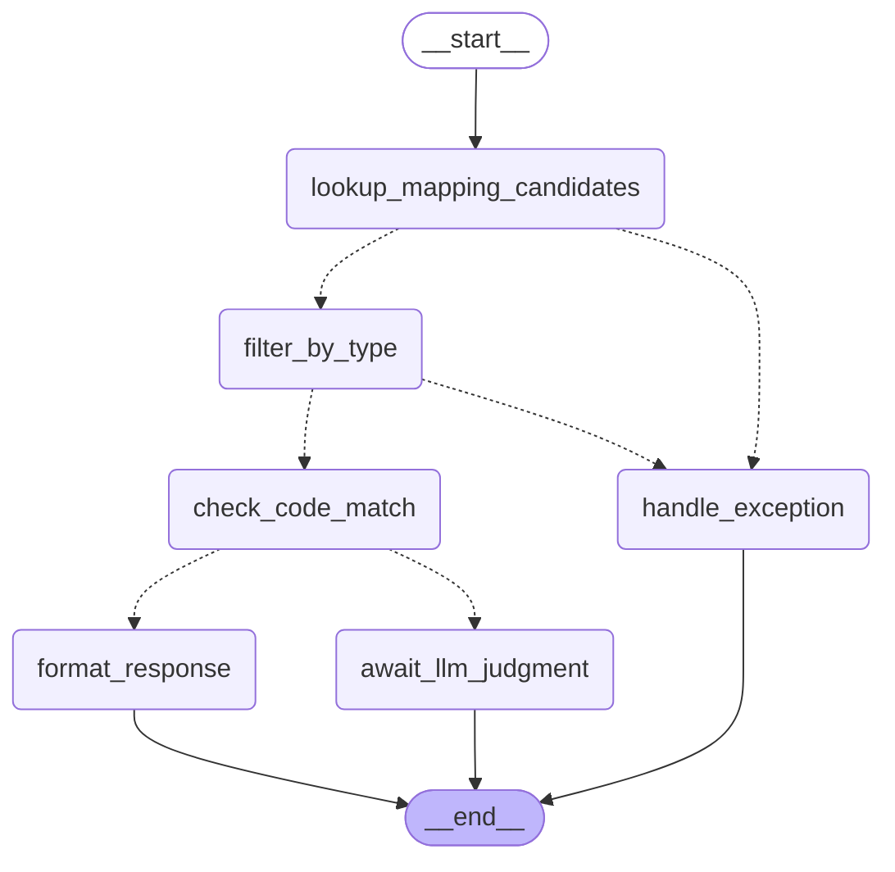

# 🦖 SchemaBridge


**AS-IS ↔ TO-BE 매핑 판단을 돕는 LLM Agent.**
증권사 차세대(핵심시스템 마이그레이션) 프로젝트에서, 매핑정의서를 대조해가며 TO-BE 쿼리를 개발하는 작업을 자동화합니다.

---

## 왜 만들었나

차세대 프로젝트에서는 AS-IS 코드를 분석해 TO-BE ERD를 설계하고, 이후 테이블·컬럼 매핑정의서를 엑셀로 수작업 작성합니다. 개발자는 TO-BE 쿼리를 짤 때마다 이 매핑정의서와 AS-IS 코드를 일일이 열어 대조해야 하는데, 문제는 AS-IS:TO-BE 관계가 항상 1:1이 아니라는 점입니다. 설계 변경으로 1:N으로 쪼개지거나 구조 자체가 바뀌는 경우, 그걸 사람이 그때그때 판단해서 반영해야 해서 개발 속도가 느려지고 실수 위험도 커집니다.

**SchemaBridge**는 매핑정의서를 근거로 여러 AS-IS 후보 중 최적 후보를 순위와 함께 추천하고, 근거가 부족하면 임의로 확정하지 않고 명시적으로 판단 불가 상태로 표시합니다.

## 핵심 시나리오

| | 설명 |
| --- | --- |
| **SC-001** (메인) | TO-BE 컬럼을 입력하면 매핑정의서를 정확 조회(Exact Lookup)해 AS-IS 후보를 찾고, `타입 필터 → 코드값 일치 → 설명 유사도/자체추론` 순으로 근거를 쌓아 순위를 매깁니다. 확신도가 낮으면 사람에게 넘기기 전에 먼저 구체적으로 되묻습니다(최대 2회). |
| **SC-002** (확장) | SC-001에서 확정된 매핑과 사전 정의된 조인 규칙으로, 범위가 제한된 TO-BE 집계 쿼리를 생성·검증·실행합니다(자유 형식 text-to-SQL이 아님). |

## 아키텍처



LangGraph로 조립된 결정적(deterministic) 판단 체인입니다. 정형 데이터(매핑정의서·코드 매핑정의서)는 벡터 검색이 아니라 정확 조회를 쓰고, 근거가 확실한 케이스만 이 단계에서 바로 확정됩니다.

| 구분 | 선택 | 이유 |
| --- | --- | --- |
| Orchestration | LangGraph | 조건부 분기·예외 상태·재시도 루프를 노드/엣지로 명시 가능 |
| LLM / Embedding | Azure OpenAI | 사내 표준 제공 자원 |
| Retrieval | Exact Lookup + 경량 유사도 (Vector DB 미사용) | 후보가 3~5개 수준으로 적어 즉석 비교로 충분 |
| Output Parsing | Structured Output (JSON Schema) | 내부 추론과 사용자 노출 근거(rationale) 분리 |
| Monitoring | Langfuse | LangGraph 콜백으로 연결 예정 |

## 지금 뭐가 되고 뭐가 안 되는지

- [x] `lookup_mapping_candidates` — 매핑정의서 정확 조회 + 버전 불일치 감지
- [x] `filter_by_type` — 타입 필수조건 필터
- [x] `check_code_match` — 코드값 일치 여부(강한 근거)
- [x] 위 3개를 LangGraph 그래프로 조립 (`src/graph.py`)
- [x] Streamlit 데모 뷰어 (`app.py`)
- [ ] `infer_secondary_evidence` — 설명 유사도 / 설명 없을 때 자체추론 (LLM 필요)
- [ ] `judge_and_rank` — 최종 순위·confidence_gap 산출 (LLM 필요)
- [ ] `request_clarification` — 정보 보완 되묻기 루프 (LLM 필요)
- [ ] `generate_rationale` — 사용자 노출용 근거 생성 (LLM 필요)
- [ ] SC-002 (신고서용 집계 쿼리 생성) 전체

결정적 로직만으로는 골든셋 12건 중 7건이 정확히 분류되고, 나머지 5건(후보가 여러 개인데 근거가 애매한 경우)은 `PENDING`으로 정직하게 표시됩니다 — 임의로 하나를 확정하지 않는 게 이 프로젝트의 핵심 설계 원칙입니다.

## 빠른 시작

```bash
cd schemabridge
python3.11 -m venv .venv
.venv/bin/pip install langgraph streamlit

# 결정적 파이프라인만 (외부 패키지 불필요)
.venv/bin/python tests/test_deterministic.py

# LangGraph로 실행
.venv/bin/python -m src.graph
.venv/bin/python -m src.graph ACC_WHT_AGG.wht_tax_amt   # 특정 컬럼만

# 브라우저 데모
.venv/bin/streamlit run app.py
```

> **Python 3.10+ 필요** — 코드가 `dict | None` 같은 최신 타입 문법을 씁니다.

## 프로젝트 구조

```
schemabridge/
├── data/            합성 데모 데이터 (스키마·매핑정의서·코드매핑·골든셋)
├── src/
│   ├── data_loader.py   JSON 로더
│   ├── lookup.py         Node: lookup_mapping_candidates
│   ├── filters.py        Node: filter_by_type
│   ├── code_match.py     Node: check_code_match
│   └── graph.py           LangGraph 조립 + 엔트리포인트
├── tests/           결정적 파이프라인 검증 스크립트
└── app.py           Streamlit 시연용 뷰어
```

---

## 이 저장소에 대하여

`schemabridge/`는 "AI Master" 8주 과정의 PoC 산출물입니다. 저장소 루트에는 이 프로젝트를 설계해온 주차별 문서(문제 정의 → 시나리오 → 상세 설계 → PoC 구현)가 함께 들어 있습니다. 자세한 작업 규칙과 구현 현황은 [`CLAUDE.md`](./CLAUDE.md)를 참고하세요.
