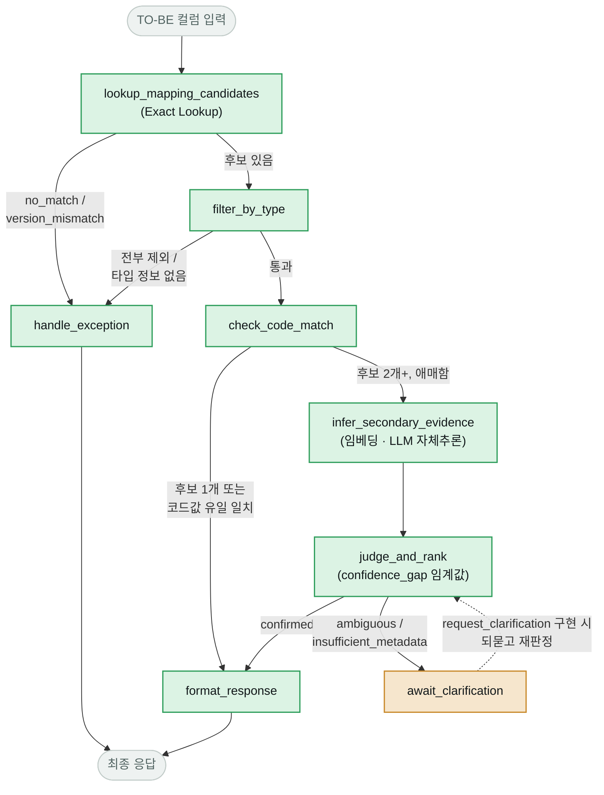
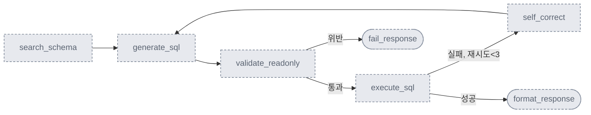

# SchemaBridge — 중간발표 진행상황

> AS-IS/TO-BE 컬럼 매핑 판단 지원 Agent. 증권사 차세대(핵심시스템 전면 교체) 프로젝트에서, 개발자가 매핑정의서를 참고해 `AS-IS` 컬럼을 `TO-BE` 컬럼에 매핑할 때 결정적 로직을 우선 적용하고 근거가 부족할 때만 LLM 판정을 더해, 근거와 함께 추천 결과를 반환한다.

## 한눈에 보는 진행 상황

| 지표 | 값 |
|---|---|
| SC-001 노드 구현·검증 완료 | 7 / 10 |
| 골든셋 결정적 판정 통과 | 12 / 12 |
| LLM 판정(`judge_and_rank`) 케이스 정상 동작 | 4 / 4 |
| SC-002 확장 노드 (계획대로 착수 전) | 0 / 5 |

## 파이프라인 아키텍처 — SC-001

지금 `schemabridge/src/graph.py`가 실제로 조립하는 LangGraph 그래프. 색은 코드로서의 구현 상태를 뜻한다.

- 🟢 **초록** — 구현·골든셋 검증 완료
- 🟠 **주황** — 임시 자리표시자 (정직하게 멈추는 지점, 진짜 기능 아님)
- ⬜ **회색 점선** — 이 그래프엔 아직 없음

**이 그래프엔 아직 없는 노드**

- `classify_intent` — SC-001 / SC-002 요청을 구분하는 진입 노드. 지금은 모든 요청을 SC-001로 간주하고 바로 lookup부터 시작
- `request_clarification` — ambiguous / insufficient_metadata일 때 사람에게 구체적으로 되묻는 루프(최대 2회). 지금은 `await_clarification`이 판정 결과만 노출하고 멈춤
- `generate_rationale` — confirmed 결과에 사용자 노출용 자연어 근거 문장을 붙이는 노드. 지금은 원시 rationale 필드를 그대로 노출

## 확장 파이프라인 — SC-002 (미착수)

SC-001이 판정까지 끝나야 착수하기로 확정된 범위(4주차 설계 결정). 자유 형식 text-to-SQL이 아니라, 확정된 매핑 + 사전 정의된 조인 규칙으로 범위가 제한된 세금 신고서용 쿼리를 생성·검증·실행한다.

## 골든셋 12건 — 시연 가능한 케이스

`ACC_WHT_AGG` TO-BE 테이블 컬럼으로 5가지 상태를 전부 재현한다. `streamlit run app.py` 데모 화면에 컬럼명을 입력하면 실시간으로 확인할 수 있다.

| 결과 | 예시 컬럼 | 판정 근거 |
|---|---|---|
| `confirmed` | `pay_dt` / `payee_nm` / `pay_amt` | 매핑정의서상 후보가 1개뿐이라 확정 |
| `confirmed` | `income_type_cd` | 공통코드 매핑정의서에서 코드값 일치 — 강한 근거로 확정 |
| `confirmed` | `wht_tax_amt` / `tax_rate` / `payee_biz_no` / `div_payee_nm` | 후보 2개 이상 → 임베딩 유사도·LLM 자체추론 → `judge_and_rank`가 점수차(confidence_gap)로 확정 |
| `no_match` | `updt_dt` / `biz_reg_no` | 매핑정의서에 해당 TO-BE 컬럼 자체가 없음 |
| `version_mismatch` | `reg_dt` | 매핑정의서가 가리키는 AS-IS 컬럼이 스키마 개편으로 사라짐 |
| `insufficient_metadata` | `div_wht_amt` | 후보의 데이터 타입 정보 자체가 없어 필수조건 판정 불가 |

## 다음 단계

우선순위 순서. SC-002는 SC-001 완료 후 착수한다.

- [x] **`judge_and_rank` 구현** — evidence_scores로 confirmed / ambiguous / insufficient_metadata 최종 판정, 골든셋 12건 회귀 검증 완료
- [x] **데모 화면(`app.py`)에 judge_and_rank 반영** — "PENDING"으로 멈추던 4개 케이스가 화면에서 바로 confirmed / ambiguous로 뜨도록 연결
- [ ] **`request_clarification` 구현** — ambiguous / insufficient_metadata일 때 사람에게 구체적으로 되묻는 루프(최대 2회 재시도)
- [ ] **`generate_rationale` 구현** — 내부 추론과 분리된, 사용자 노출용 근거 문장 생성
- [ ] **SC-002 착수** — SC-001 완료 기준(골든셋 12건 + 예외 4종 분류) 충족 후 진행

---

*schemabridge · AI Master 4주차 설계 기반 PoC · 라이브 데모: `streamlit run app.py`*
